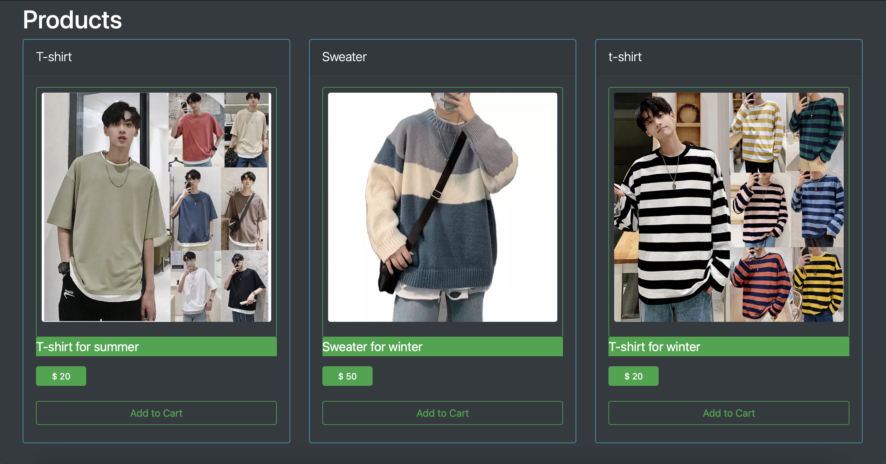

# Ecommerce Project 

### Requirements:
* Python3 
* Node.JS
* Pipenv 
* npm 

# How clone and start the code 
## Software Requirements

- <b>Python3</b>: Click [Here](https://www.python.org/downloads/) to download Python
- <b>Node.js</b>: Click [Here](https://nodejs.org/en/download/) to download node.js

### There are two panels inside the projects:

* Admin
* User

# Windows Setup Guide
1. <b>Search 'Power Shell' in search box, and open the Power Shell. </b>
2. cd \Desktop\
2. git clone https://github.com/Sameam/ecommerce.git
3. cd .\ecommerce
4. pip install --upgrade pip
5. pip install pipenv
6. Set-ExecutionPolicy Unrestricted -Scope Process
7. pipenv shell *(Note, if the pipenv is not activate, maybe user need to add to path variable)
8. cd .\ecom
9. pip install -r ./Python_File/requirements.txt
### User will need to create a database 

### In order to create database
### Windows Setup Guide
python manage.py makemigrations
python manage.py migrate

10. python3 manage.py runserver
11. open another new terminal, change directory to .\frontend
12. npm install
13. npm start **(This will start the web run on your Machine Local Host)**

# MacOS Setup Guide
1. <b>Hold 'command + space' and search for 'Terminal', and open the Terminal </b>
2. cd ~/Desktop
3. git clone https://github.com/Sameam/ecommerce.git
4. cd ./ecommerce 
5. pip3 install --upgrade pip3
6. pip3 install pipenv
7. pipenv shell
8. cd ./ecom
9. pip3 install -r ./Python_File/requirements.txt
### User will need to create a database 

### In order to create database
### Windows Setup Guide
python3 manage.py makemigrations
python3 manage.py migrate

10. python3 manage.py runserver
11. open another new terminal, change directory to ./frontend
12. npm install
13. npm start **(This will start the web run on your Machine Local Host)**

# Linux Setup Guide
1. <b>Open the Terminal </b>
2. cd ~/Desktop
3. git clone https://github.com/Sameam/ecommerce.git
4. cd ecommerce

**Step 4 and 5 is needed if you Linux system is not update with the newest package yet**

4. sudo apt-get update
5. sudo apt-get upgrade
7. sudo apt-get install python3.8
8. pip3 install --upgrade pip3
9. pip3 install pipenv
10. pipenv shell
11. cd ./ecom
12. pip3 install -r ./Python_File/requirements.txt

### User will need to create a database 

### In order to create database
### Windows Setup Guide
python3 manage.py makemigrations
python3 manage.py migrate

10. python3 manage.py runserver
11. open another new terminal, change directory to ./frontend
12. sudo apt install nodejs
13. sudo apt install npm
14. npm install
15. npm start **(This will start the web run on your Machine Local Host)**

# Future start after follow the step above 
**Make sure you are in ecommerce directory**
1. cd ./ecom
2. python3 manage.py runserver
3. open another terminal 
4. cd ./frontend
5. npm start

### There are two panels inside the projects:

* Admin
* User

### How To Create An Admin User

Run The Command
---->python manage.py createsuperuser(In windows)
---->sudo python3 manage.py createsuperuser (In Linux)
---->python manage.py createsuperuser (In Mac) 
Enter the details asked by the Command Prompt It will create a new super user.

### In order to run django admin panel:
After the django run on localhost, redirect the link to /admin and signin. 

